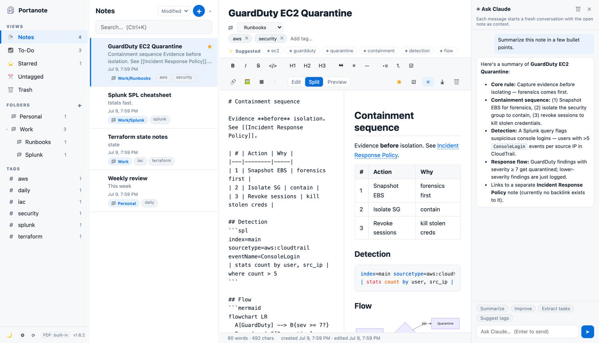
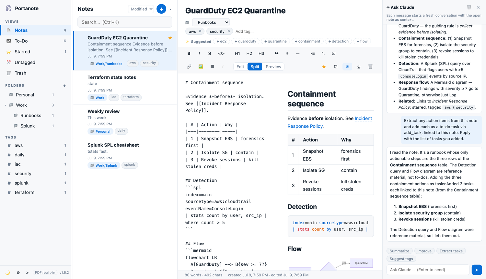

<h1 align="center">
  <br>
  Portanote
</h1>

**A portable, single-binary notes app.** No installation, no admin rights, no Electron. Portanote is one small executable that serves a local web UI to your browser — your notes are plain Markdown files sitting right next to it, so your data is always yours.



<sub>A dark theme is built in too — [dark screenshot](docs/screenshot-dark.png).</sub>

---

## Why Portanote

- **Truly portable.** A ~10 MB binary you can run from a USB stick, a locked-down work laptop, or your home PC — nothing is installed and nothing touches the registry. Delete the folder and every trace is gone.
- **Your data is just files.** Every note is a `.md` file with YAML frontmatter. Back it up, sync it, grep it, or edit it in any other editor. No database, no lock-in.
- **Private by default.** It binds to `127.0.0.1` and talks to nothing on the internet unless you explicitly ask it to — checking for updates (GitHub) or using the optional Ask Claude panel (Anthropic).

## Features

- **Standard-Notes-style three-pane UI** — a collapsible nested-folder tree and tags in the sidebar, a searchable note list, and a Markdown editor with live preview (edit / split / preview), dark mode, starring, trash, and drag-resizable panes.
- **GitHub-Flavored Markdown editor** with a formatting toolbar (headings, bold/italic/strikethrough, lists, task lists, tables, code, links, images) and a built-in Markdown quick-reference (the `❔` button).
- **Rich rendering** — syntax highlighting for the common languages plus **PowerShell, Splunk SPL, Dockerfile, and nginx**, and **Mermaid diagrams** (```` ```mermaid ````) drawn live in the preview and in exports.
- **Wiki-links & backlinks** — `[[Note Title]]` (or `[[Title|alias]]`) links notes together, and each note shows a "Linked references" panel of what points to it.
- **Nested folders** — organize notes in a real `Work/Runbooks/AWS`-style tree, with drag-and-drop, subtree counts, and collapsible groups. Folders are real subdirectories of `notes/`, so your file manager, `grep`, and other editors see the same structure.
- **Sync with disk** — the `⟳` button in the sidebar re-indexes the notes folder on demand, adopting files and folders you added, edited, or removed outside the app (file explorer, git, another editor) without a restart.
- **Fast search with operators** — an in-memory full-text index (search-as-you-type), plus `tag:`, `folder:`, `is:starred` / `is:untagged` / `is:trashed`, `after:`, and `before:`.
- **Auto-tag suggestions** — an offline pass over your note titles and headers proposes topic tags under the tag row; one click accepts. Nothing is sent anywhere.
- **A standalone To-Do list** — add / complete / reorder (drag) / delete tasks and clear completed ones. The `☑` button in a note's toolbar creates a task linked back to that note.
- **Note templates** — a `templates/` folder of reusable skeletons (Meeting Notes, Runbook, Daily Log to start), from the `▾` beside the new-note button.
- **Paste-to-attach** — paste a screenshot straight into a note; it's saved under `attachments/` and inserted as an image.
- **PDF export, two ways** — a built-in "Print / Save as PDF" that works everywhere, and a true **Eisvogel** LaTeX export (optional portable tools) with a toggleable title page and table of contents.
- **Automatic backups** — zips your whole notes folder on a schedule (default every 3 hours, keep the last 12), adjustable in the ⚙ settings with a "Back up now" button.
- **Multi-select bulk actions** — Ctrl/Shift-click notes to move, star, or trash them together.
- **Built-in MCP server** — AI tools (Claude Code, Claude Desktop, and any other MCP client) can search, read, create, and edit your notes over the [Model Context Protocol](https://modelcontextprotocol.io) at `/mcp`. Same localhost-only privacy as the UI. [Details below](#mcp-server-connect-ai-tools).
- **Ask Claude panel** — if the [Claude Code CLI](https://claude.com/claude-code) is installed on your machine, a `✳` button in the note toolbar opens a chat panel about the open note: summarize, improve, extract action items straight into the To-Do list, suggest tags, or ask anything. Uses your existing Claude login; Claude only gets Portanote's own note tools (no shell or file access). [Details below](#ask-claude-built-in-ai-optional).

---

## Download & run

Grab the binary for your machine from the **[Releases page](https://github.com/jake-kelley/portanote/releases/latest)** (direct links below), drop it anywhere, and run it. Your browser opens to the app, and a `notes/` folder is created next to the binary.

| Platform | Download |
|----------|----------|
| **Windows** (64-bit) | [`portanote-windows-amd64.exe`](https://github.com/jake-kelley/portanote/releases/latest/download/portanote-windows-amd64.exe) |
| **macOS** (Apple Silicon / M-series) | [`portanote-macos-arm64`](https://github.com/jake-kelley/portanote/releases/latest/download/portanote-macos-arm64) |

Once installed, Portanote keeps itself current: **⚙ Settings → Check for updates** fetches the latest release, verifies its checksum, swaps the binary in place, and restarts on the same port — notes, settings, and autostart launchers are untouched. Works on Windows and macOS. (If you make the repository private, set a `PORTANOTE_GITHUB_TOKEN` environment variable with a GitHub token so the updater can reach the releases API.)

### Windows

Double-click `portanote-windows-amd64.exe`. Your browser opens at `http://127.0.0.1:8737`; notes live in a `notes\` folder beside the exe. SmartScreen may warn about an unrecognized app — choose **More info → Run anyway** (it's an unsigned binary you built/downloaded, not malware).

### macOS (Apple Silicon)

Copy the binary anywhere (USB stick, `~/Documents`, …), then in Terminal:

```sh
chmod +x portanote-macos-arm64
xattr -d com.apple.quarantine portanote-macos-arm64   # only if it was downloaded via a browser
./portanote-macos-arm64
```

If Gatekeeper still objects ("cannot be opened because it is from an unidentified developer"), go to **System Settings → Privacy & Security → Open Anyway**, or right-click the binary → Open. Nothing is installed.

### Command-line flags

| Flag | Purpose |
|------|---------|
| `-dir path/to/notes` | Use a specific notes folder (default: `notes/` next to the binary) |
| `-port 8737` | Port to listen on (walks upward if busy) |
| `-no-browser` | Don't open a browser on start |
| `-host 127.0.0.1` | Bind address. `127.0.0.1` = localhost only (default). `0.0.0.0` = whole network. `subnet` = whole network but only accept clients on this device's local subnet (auto-detected), everything else gets `403`. |

Reaching it from your phone: run with `-host subnet` and open the `http://<this-device-ip>:<port>` URL it prints, on the same Wi-Fi. There's no password on the served notes, so only do this on networks you trust — and note the OS firewall may still need to allow the port.

### Run automatically on startup (background, no terminal window)

Running the binary normally keeps a console window open. To have Portanote start on login and run quietly in the background, use a launcher with `-no-browser` (so it doesn't pop a browser every boot) and just open `http://127.0.0.1:8737` in your browser whenever you want it (bookmark it).

**Windows** — hidden launcher in the Startup folder:

1. Next to the exe, create a file `portanote.vbs` containing one line (adjust the two paths; `0` = hidden window):

   ```vbs
   CreateObject("WScript.Shell").Run """C:\Users\you\portanote\portanote-windows-amd64.exe"" -no-browser -dir ""C:\Users\you\portanote\notes""", 0, False
   ```

2. Press `Win + R`, type `shell:startup`, and press Enter — this opens your Startup folder.
3. Drop `portanote.vbs` (or a shortcut to it) into that folder.

It now starts hidden at every login. **Stop it:** Task Manager → end `portanote-windows-amd64.exe`. **Disable autostart:** remove the file from the Startup folder.

**macOS** — a LaunchAgent:

1. Make the binary runnable and clear Gatekeeper once by launching it manually (right-click → Open), then quit it:
   ```sh
   chmod +x portanote-macos-arm64
   xattr -d com.apple.quarantine portanote-macos-arm64
   ```
2. Create `~/Library/LaunchAgents/com.portanote.app.plist` (adjust the paths):

   ```xml
   <?xml version="1.0" encoding="UTF-8"?>
   <!DOCTYPE plist PUBLIC "-//Apple//DTD PLIST 1.0//EN" "http://www.apple.com/DTDs/PropertyList-1.0.dtd">
   <plist version="1.0">
   <dict>
     <key>Label</key><string>com.portanote.app</string>
     <key>ProgramArguments</key>
     <array>
       <string>/Users/you/portanote/portanote-macos-arm64</string>
       <string>-no-browser</string>
       <string>-dir</string>
       <string>/Users/you/portanote/notes</string>
     </array>
     <key>RunAtLoad</key><true/>
     <key>KeepAlive</key><true/>
   </dict>
   </plist>
   ```

3. Load it: `launchctl load ~/Library/LaunchAgents/com.portanote.app.plist`

It starts at login (and restarts if it ever crashes), with no terminal window. **Stop & disable:** `launchctl unload ~/Library/LaunchAgents/com.portanote.app.plist`, then delete the plist.

---

## True Eisvogel PDF export (optional)

The built-in **Print / Save as PDF** works with zero setup. For polished LaTeX PDFs, drop two portable tools next to the binary:

```powershell
# Windows
powershell -ExecutionPolicy Bypass -File scripts\get-tools.ps1
```
```sh
# macOS
sh scripts/get-tools.sh
```

This downloads [pandoc](https://github.com/jgm/pandoc) and [tectonic](https://tectonic-typesetting.github.io/) (a self-contained LaTeX engine) into a `tools/` folder — no installation. The app detects them (the sidebar badge flips to **PDF: eisvogel**) and the export menu's Eisvogel options enable, with checkboxes for a front title page and a table of contents. The first export downloads ~100 MB of LaTeX packages into `tools/tectonic-cache/` and takes a few minutes; after that it's fast and works offline.

---

## Using Portanote

### Markdown

Portanote renders GitHub-Flavored Markdown. The `❔` toolbar button opens a full cheat sheet; the highlights:

| Syntax | Result |
|--------|--------|
| `# H1` · `## H2` … | Headings |
| `**bold**` · `*italic*` · `~~strike~~` | Emphasis |
| `- [ ] todo` · `- [x] done` | Task-list checkboxes |
| `` `code` `` and fenced ```` ```lang ```` blocks | Inline / block code with syntax highlighting |
| `\| a \| b \|` + `\|---\|---\|` | Tables |
| `[[Note Title]]` | Wiki-link to another note |
| ```` ```mermaid ```` | A Mermaid diagram |
| `[text](url)` · `` | Links & images (or just paste a screenshot) |

### Folders

Folders are `/`-separated paths (`Work/Runbooks/AWS`) shown as a collapsible tree. The `+` by the *Folders* header makes a new one (use `/` to nest); hover a folder for a `＋` (add subfolder) and `✕` (delete). Double-click to rename. Drag notes from the list onto a folder to move them. Deleting a folder makes its notes uncategorized — it never deletes notes.

### Sync with disk (⟳)

Since folders and notes are just directories and `.md` files, you can reorganize them with any tool you like — File Explorer, Finder, git, a script. Click the `⟳` button in the sidebar footer afterwards and Portanote re-indexes the whole notes folder, adopting everything you added, edited, moved, or deleted; the button flashes the number of changes it found. (A restart does the same thing.)

### Tags & suggestions

Add tags in the tag row under a note's title. As you write, a **✨ Suggested** row proposes tags derived from the note's title and headers — click one to accept. Suggestions are computed locally; nothing leaves your machine.

### Search

Type in the search box for instant full-text results. Combine free text with operators:

```
tag:aws folder:Work/Runbooks is:starred after:2026-06-01 firewall
```

Supported: `tag:`, `folder:`, `is:starred`, `is:untagged`, `is:trashed`, `after:YYYY-MM-DD`, `before:YYYY-MM-DD`.

Search is **scoped to the folder you're in**: with a folder selected in the sidebar, results come from that folder and its subfolders only, and a bar under the search box lets you flip the same query to all notes (and back). On the top-level *Notes* view search is always global, so no bar appears. An explicit `folder:` operator overrides the scoping either way.

### To-Do

Open the **To-Do** view for a standalone task list — independent of your notes. Type in the box and press Enter to add a task; check it off to complete; drag the `⠿` handle to reorder; hover for the `✕` to delete; and use **Clear completed** to wipe finished ones. From any note, the toolbar `☑` button creates a task titled after that note and linked to it — the task shows a 🔗 chip you can click to jump back to the note.

### Templates

Files in the `templates/` folder become reusable note skeletons, offered by the `▾` next to the new-note button. Three starters (Meeting Notes, Runbook, Daily Log) are created on first run. To make your own, open a note with the structure you want and choose **＋ Save current note as template…** from that `▾` menu — its body becomes a new template. Hover a template in the menu for the `✕` to delete it (or just edit/remove the `.md` files in `templates/` directly).

### Backups & settings (⚙)

The gear in the sidebar footer opens settings. Automatic backups zip the whole notes folder into `backups/` on your chosen interval, keeping the last *N* (the `backups/` folder itself is excluded). "Back up now" runs one immediately.

### Keyboard shortcuts

| Keys | Action |
|------|--------|
| `Ctrl/⌘ + Alt + N` | New note |
| `Ctrl/⌘ + K` | Focus search |
| `Ctrl/⌘ + S` | Save now (autosave runs anyway, ~0.6 s after you stop typing) |
| `Ctrl/⌘ + E` | Cycle edit / split / preview |
| `Ctrl/⌘ + B` · `I` · `` ` `` · `L` | Bold · italic · code · link (in the editor) |
| `Esc` | Clear search / close a dialog |

---

## Your data

Everything lives in your notes folder, and the folder tree in the app **is** the directory tree on disk:

```
notes/
├── 05JULY2026-guardduty-ec2-quarantine.md   # one file per note
├── Work/
│   └── Runbooks/
│       └── 03JULY2026-aws-guardduty.md      # the note's folder = its directory
├── attachments/                              # pasted images (reserved)
├── templates/                                # note templates (reserved)
├── backups/                                  # automatic backup zips (reserved)
├── .portanote-tasks.json                     # your to-do list
└── .portanote-settings.json                  # backup settings
```

Notes are named **`DDMONTHYYYY-title-slug.md`** — e.g. a note titled *Test Deployment* created on 5 July 2026 becomes `05JULY2026-test-deployment.md`. Rename the title and the file follows (the date stays as the created date); moving a note to another folder moves the file. A stable `id` in the frontmatter keeps everything linked, so renames and moves never break wiki-links or task links.

```markdown
---
id: "20260705-043521-2f04bc"
title: "AWS GuardDuty Runbook"
tags: [aws, security]
starred: true
trashed: false
created: 2026-07-05T04:35:21Z
updated: 2026-07-05T04:35:21Z
---

# Containment
...
```

Files without frontmatter are adopted as-is (the title comes from the first heading, timestamps from the file, the folder from the directory it sits in), so you can drop an existing Markdown folder — subfolders and all — into `notes/` and it just works. Files added while the app is running are indexed when you click the `⟳` sync button in the sidebar (or on the next start). The names `templates`, `backups`, and `attachments` are reserved for Portanote at the top level, and dot-directories are ignored. Trash is a flag, not a folder — "Delete forever" in the Trash view is what actually removes a file.

> **Upgrading from ≤ v1.0?** The old flat layout (a `folder:` frontmatter field plus `.portanote-folders.json`) is migrated automatically on first start: each note's file moves into its folder's directory and the manifest is replaced by the directories themselves.

---

## Ask Claude (built-in AI, optional)

If the [Claude Code CLI](https://claude.com/claude-code) is installed and logged in on the machine running Portanote, a `✳` button appears in the note toolbar. It opens a chat panel that knows which note you have open:




- **Quick actions**: *Summarize*, *Improve* (suggestions only, never silent edits), *Extract tasks* (action items land in your To-Do list, linked back to the note), *Suggest tags*.
- **Free-form**: ask anything about the note or your collection — Claude can search, read, create, and edit notes through Portanote's own MCP tools.
- **Targeted edits**: highlight lines in the editor before sending and Claude receives those line numbers and their content as the region you mean — "fix this", "rewrite these lines", "expand this section" apply right there. A `✂ Targeting lines N–M` chip above the composer shows what's selected.

How it works and what it can touch: each message spawns a fresh headless `claude` process that connects back to this Portanote instance over localhost. It is restricted to Portanote's note/task tools — no shell, no file access, no web. Anything it changes goes through the same store as the UI (so edits are indexed instantly, and "deleting" is only ever the recoverable trash). Your editor autosaves before each message and locks while Claude works; the note and To-Do list refresh when it finishes.

Notes: messages (and the notes Claude reads to answer them) are sent to Anthropic through your own Claude account, and usage counts against your plan. Each message starts a fresh conversation.

**Settings & logs** (⚙ Settings → *Ask Claude*): Portanote auto-detects the `claude` executable and settings file at launch — checking your `PATH` first, then the usual install locations (`~/.local/bin`, Homebrew, …) so a background-launched instance on macOS still finds it. The settings fields are pre-filled with what was detected; point them at a specific binary or `--settings` file if you'd rather, or clear a field to go back to auto-detect. There's also an **Environment variables** box (one `KEY=VALUE` per line) that gets merged into the spawned `claude` — set `NODE_EXTRA_CA_CERTS=/path/to/root.crt` here to make Claude Code trust a corporate TLS-inspecting proxy (Zscaler and the like). Portanote also reads the `env` block from your `claude` settings file automatically and applies it to each turn, so vars you already keep there (proxy CAs, `CLAUDE_CODE_USE_VERTEX` and other routing) just work — even those Node needs set before startup, which a plain settings file can miss; the box overrides settings.json where they overlap, and the section lists what was auto-loaded. Below that, an activity log lists recent prompts and any errors (the exact CLI error is captured, so a "not logged in" or certificate problem shows up there). If the button doesn't appear, open that section to see what was detected — or run `claude` once in a terminal to log in, then restart Portanote.

---

## MCP server (connect AI tools)

While Portanote is running it also serves a **[Model Context Protocol](https://modelcontextprotocol.io) endpoint** at `http://127.0.0.1:8737/mcp` (Streamable HTTP transport, implemented in the same dependency-free binary). Any MCP client can connect and work with your notes — search, read, create, edit, organize, and manage the to-do list.

**Claude Code** (one-time, from any directory):

```sh
claude mcp add --transport http portanote http://127.0.0.1:8737/mcp
```

This repo also ships a `.mcp.json`, so Claude Code sessions started inside the project folder pick the server up automatically.

**Claude Desktop:** Settings → Connectors → *Add custom connector* → URL `http://127.0.0.1:8737/mcp`.

**Clients that only speak stdio** can bridge with [`mcp-remote`](https://www.npmjs.com/package/mcp-remote): command `npx`, args `mcp-remote http://127.0.0.1:8737/mcp`.

> If port 8737 was busy, Portanote walks upward to the next free port — the startup log prints the actual MCP URL. Use `-port` to pin it.

### Tools

| Tool | What it does |
|------|--------------|
| `search_notes` | Full-text search (title, tags, body) with relevance scores |
| `list_notes` | List notes, filterable by folder (incl. subfolders), tag, starred |
| `read_note` | Full Markdown body + backlinks for one note |
| `create_note` | New note with optional body, folder, tags |
| `update_note` | Edit title/body/folder/tags/starred; `trashed: true` moves to trash |
| `list_folders` / `list_tags` | Browse your organization scheme |
| `rescan_notes` | Re-index the notes folder after files changed outside Portanote |
| `list_tasks` / `add_task` / `update_task` | Work the standalone to-do list |

**Safety notes:** the MCP surface can *trash* notes (recoverable in the UI) but deliberately has no permanent-delete tool. The endpoint follows the same bind rules as the UI (localhost-only by default; `-host subnet` extends it to your subnet), rejects browser cross-origin requests to block DNS-rebinding, and — like the rest of Portanote — has no authentication, so only expose it on networks you trust.

---

## Build from source

Portanote is pure-stdlib Go (no dependencies to fetch); the UI and the Eisvogel template are embedded via `go:embed`, so the output is a single self-contained binary.

```powershell
# Windows — builds both targets into dist\
powershell -ExecutionPolicy Bypass -File scripts\build.ps1
```
```sh
# any platform
GOOS=windows GOARCH=amd64 go build -ldflags="-s -w" -o dist/portanote-windows-amd64.exe .
GOOS=darwin  GOARCH=arm64 go build -ldflags="-s -w" -o dist/portanote-macos-arm64 .
```

Releases are built automatically: pushing a `vX.Y.Z` tag runs `.github/workflows/release.yml`, which cross-compiles the binaries and attaches them to a GitHub Release.

```
portanote/
├── main.go · api.go · notes.go · search.go · export.go · tasks.go · backups.go · templates.go
├── ui/            # embedded frontend (vanilla JS + marked / DOMPurify / highlight.js / mermaid)
├── pandoc/        # eisvogel.latex (embedded at build)
├── scripts/       # get-tools.ps1 · get-tools.sh · build.ps1
├── docs/          # screenshots
└── .github/workflows/release.yml
```

## Search: why a lexical index and not a vector DB

Semantic search would need an embedding model (~100 MB plus a native runtime per platform), which fights the single-binary, no-install promise — and for note lookup a well-tuned lexical index is usually *better*: exact terms, prefixes as you type, title/tag boosting, and zero latency. If semantic search ever becomes worth it, the API already returns scored results, so a local embedding sidecar can merge in without changing the UI.

---

> Not affiliated with or endorsed by any of the tools it interoperates with. Verify anything security-, pricing-, or compliance-related against primary sources.
